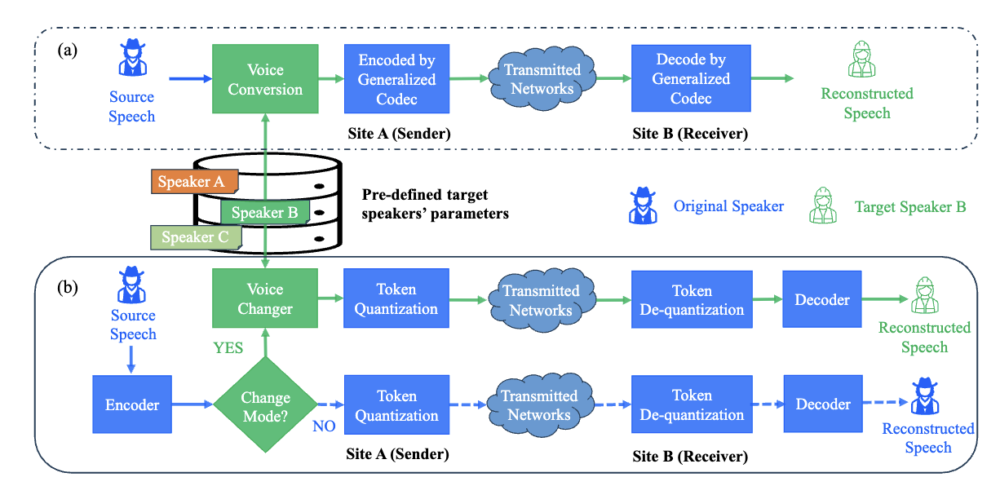

# 
 LiteSwitchCodec: Neural Speech Coding with Token Space Quantization and Causal U-Net for Real-time Personalized Communications 

anonymous authors

## Abstract
This paper presents LiteSwitchCodec, a lightweight and multi-functional neural speech codec designed for real-time communication (RTC). 
It aims to achieve high-quality reconstruction while facilitating real-time personalized communication by integrating a voice adaptation (VA) module.
For speech reconstruction, LiteSwitchCodec employs fully causal convolutional layers as the encoder and decoder to meet real-time requirements and reduces the complexity of decoder through a mirrored structure.
Due to the large codebook storage by the residual vector quantization, we map the semantic features in the compressed domain to a discrete space via finite scalar quantization, generating semantic-aware quantized tokens. 
A lightweight causal U-Net model is introduced in the semantic token space to extract global semantic information for personalized VA, supporting dynamic switching of target speakers.
To realize them, we propose a two-stage training strategy.
First, we train the LiteSwitchCodec on public datasets for speech reconstruction.
We then construct a voice conversion (VC) dataset to train the token-level causal U-Net VA network.
Experiments demonstrate that LiteSwitchCodec maintains RTC quality while reducing model parameters by 38x compared to the state-of-the-art descript audio codec, achieving an objective quality of ViSQOL: 4.32 at 7.2kbps. 
Moreover, LiteSwitchCodec achieves real-time VA with a low latency of 40 ms by only increasing 4 million parameters. 
Compared with VC models in RTC, our method shows superior performance in both subjective and objective metrics, achieving a 92.61\% similarity score (MOS: 4.67 v.s 3.59), highlighting its excellent performance in personalized communication. 
LiteSwitchCodec provides a solution for real-time personalized communication in online conferences.

<!-- 
comments
## Model Overview

-->
# Demo of original voice mode

"Ref" denotes the reference speech. We have provided samples compressed by various codecs, including both signal processing-based and neural-based methods. In these comparisons, "LiteSwitchCodec@7.2kbps" specifically refers to our original voice model.

##     Demo of female

###    English 

 |Ref |Opus@6kbps| Lyra2@6kbps | EVS@7.2kbps | Opus@8kbps | LiteSwitchCodec@7.2kbps| Lyra2@9.2kbps | EVS@9.6kbps | Opus@10kbps | Opus@16kbps|
 |:--- |:--- | :--- | :--- | :--- | :--- | :--- | :--- | :--- | :--- |
 |<audio src="demo_orig/Eng/Female/Female_01.wav" controls preload></audio> | <audio src="demo_orig/Eng/Female/Female_02.wav" controls preload></audio> |<audio src="demo_orig/Eng/Female/Female_03.wav" controls preload></audio> | <audio src="demo_orig/Eng/Female/Female_04.wav" controls preload></audio> | <audio src="demo_orig/Eng/Female/Female_05.wav" controls preload></audio> | <audio src="demo_orig/Eng/Female/Female_01_liteswtichcodec.wav" controls preload></audio> | <audio src="demo_orig/Eng/Female/Female_07.wav" controls preload></audio> | <audio src="demo_orig/Eng/Female/Female_08.wav" controls preload></audio> | <audio src="demo_orig/Eng/Female/Female_09.wav" controls preload></audio> | <audio src="demo_orig/Eng/Female/Female_10.wav" controls preload></audio> |
 |--- | --- | --- | --- | --- | --- | --- | --- | --- | --- |

##     Demo of male

###    English 

 |Ref |Opus@6kbps| Lyra2@6kbps | EVS@7.2kbps | Opus@8kbps | LiteSwitchCodec@7.2kbps| Lyra2@9.2kbps | EVS@9.6kbps | Opus@10kbps | Opus@16kbps|
 |:--- |:--- | :--- | :--- | :--- | :--- | :--- | :--- | :--- | :--- |
 |<audio src="demo_orig/Eng/Male/Male_01.wav" controls preload></audio> | <audio src="demo_orig/Eng/Male/Male_02.wav" controls preload></audio> |<audio src="demo_orig/Eng/Male/Male_03.wav" controls preload></audio> | <audio src="demo_orig/Eng/Male/Male_04.wav" controls preload></audio> | <audio src="demo_orig/Eng/Male/Male_05.wav" controls preload></audio> | <audio src="demo_orig/Eng/Male/Male_01_liteswtichcodec.wav" controls preload></audio> | <audio src="demo_orig/Eng/Male/Male_07.wav" controls preload></audio> | <audio src="demo_orig/Eng/Male/Male_08.wav" controls preload></audio> | <audio src="demo_orig/Eng/Male/Male_09.wav" controls preload></audio> | <audio src="demo_orig/Eng/Male/Male_10.wav" controls preload></audio> |
 |--- | --- | --- | --- | --- | --- | --- | --- | --- | --- |

##     Demo of female
###    Mandarin 

|Ref | LiteSwitchCodec@7.2kbps | DAC@8kbps  | Encodec@12kbps   | SpeechTokenizer| 
|:---: | :---: | :---: | :---: | :---: | 
 |<audio src="demo_orig/female/Ref_p501/p501_CN_F1_68.wav" controls preload></audio> | <audio src="demo_orig/female/LiteSwitchCodec/p501_CN_F1_68.wav" controls preload></audio> |<audio src="demo_orig/female/DAC/p501_CN_F1_68.wav" controls preload></audio> | <audio src="demo_orig/female/Encodec/p501_CN_F1_68.wav" controls preload></audio> | <audio src="demo_orig/female/SpeechTokenizer/p501_CN_F1_68.wav" controls preload></audio> |
 |--- | --- | --- | --- | --- |

##      Demo of male
###     Mandarin 

|Ref | LiteSwitchCodec@7.2kbps | DAC@8kbps  | Encodec@12kbps   | SpeechTokenizer| 
|:---: | :---: | :---: | :---: | :---: | 
 |<audio src="demo_orig/male/Ref_p501/p501_CN_M1_70.wav" controls preload></audio> | <audio src="demo_orig/male/LiteSwitchCodec/p501_CN_M1_70.wav" controls preload></audio> |<audio src="demo_orig/male/DAC/p501_CN_M1_70.wav" controls preload></audio> | <audio src="demo_orig/male/Encodec/p501_CN_M1_70.wav" controls preload></audio> | <audio src="demo_orig/male/SpeechTokenizer/p501_CN_M1_70.wav" controls preload></audio> |
 |--- | --- | --- | --- | --- |

# Demo of voice changer mode

## Demo of target timbre 1 from AISHELL3

The “target label” denotes the actual target speech signal. 
“Ref” stands for reference timbre of target speaker.
“source” is the input speech signal. “Original” refers to our original voice mode, while “LiteSwitchCodec” refers to our voice changer mode.

**Please slide the mouse to select different files for listening**.

### English 

 |Target label |Ref | Source | Original | LiteSwitchCodec | DDDM-VC | QuickVC | DiffVC | VQMIVC|
 |:--- |:--- | :--- | :--- | :--- | :--- | :--- | :--- | :--- |
 |<audio src="demo_SSB0273_taslp/English/Target label/p236_503.wav" controls preload></audio> | <audio src="demo_SSB0273_taslp/English/Ref/p361_060_mic2_p361_167_mic2.wav" controls preload></audio> |<audio src="demo_SSB0273_taslp/English/Source/p236_503.wav" controls preload></audio> | <audio src="demo_SSB0273_taslp/English/Original/p236_503.wav" controls preload></audio> | <audio src="demo_SSB0273_taslp/English/LiteSwitchCodec/p236_503.wav" controls preload></audio> | <audio src="demo_SSB0273_taslp/English/DDDM_VC/p236_503.wav" controls preload></audio> | <audio src="demo_SSB0273_taslp/English/QuickVC/p236_503.wav" controls preload></audio> | <audio src="demo_SSB0273_taslp/English/DiffVC/p236_503.wav" controls preload></audio> | <audio src="demo_SSB0273_taslp/English/VQMIVC/p236_503.wav" controls preload></audio> |
 |--- | --- | --- | --- | --- | --- | --- | --- | --- | --- |

### Mandarin 

  
| Target label                                              |  Ref                                                         | Source                                                      | Original                                                    | LiteSwitchCodec                                                | DDDM-VC                                                    | QuickVC                                                     | DiffVC                                                      | VQMIVC|                                                      
 |:--- |:--- | :--- | :--- | :--- | :--- | :--- | :--- | :--- |
  | <audio src="demo_SSB0273_taslp/mandarin/Target label/481_0600.wav" controls preload></audio> | <audio src="demo_SSB0273_taslp/mandarin/Ref/p361_060_mic2_p361_167_mic2.wav" controls preload></audio> |<audio src="demo_SSB0273_taslp/mandarin/Source/481_0600.wav" controls preload></audio> | <audio src="demo_SSB0273_taslp/mandarin/Original/481_0600.wav" controls preload></audio> | <audio src="demo_SSB0273_taslp/mandarin/LiteSwitchCodec/481_0600.wav" controls preload></audio> | <audio src="demo_SSB0273_taslp/mandarin/DDDM_VC/481_0600.wav" controls preload></audio> | <audio src="demo_SSB0273_taslp/mandarin/QuickVC/481_0600.wav" controls preload></audio> | <audio src="demo_SSB0273_taslp/mandarin/DiffVC/481_0600.wav" controls preload></audio> | <audio src="demo_SSB0273_taslp/mandarin/VQMIVC/481_0600.wav" controls preload></audio> |
   |--- | --- | --- | --- | --- | --- | --- | --- | --- | --- |

## Demo of target timbre 2 from VCTK

The “target label” denotes the actual target speech signal. “Ref” stands for reference timbre of target speaker. “source” is the input speech signal. “Original” refers to our original voice mode, while “LiteSwitchCodec” refers to our voice changer mode.

**Please slide the mouse to select different files for listening**.

### English 

 |Target label |Ref | Source | Original | LiteSwitchCodec | DDDM-VC | QuickVC | DiffVC | VQMIVC|
 |:--- |:--- | :--- | :--- | :--- | :--- | :--- | :--- | :--- |
 |<audio src="demo_p231_taslp/English/Target label/p236_503.wav" controls preload></audio> | <audio src="demo_p231_taslp/English/Ref/p231_008_mic2_p231_076_mic2.wav" controls preload></audio> |<audio src="demo_p231_taslp/English/Source/p236_503.wav" controls preload></audio> | <audio src="demo_p231_taslp/English/Original/p236_503.wav" controls preload></audio> | <audio src="demo_p231_taslp/English/LiteSwitchCodec/p236_503.wav" controls preload></audio> | <audio src="demo_p231_taslp/English/DDDM_VC/p236_503.wav" controls preload></audio> | <audio src="demo_p231_taslp/English/QuickVC/p236_503.wav" controls preload></audio> | <audio src="demo_p231_taslp/English/DiffVC/p236_503.wav" controls preload></audio> | <audio src="demo_p231_taslp/English/VQMIVC/p236_503.wav" controls preload></audio> |
 |--- | --- | --- | --- | --- | --- | --- | --- | --- | --- |

### Mandarin 

| Target label                                              |  Ref                                                         | Source                                                      | Original                                                    | LiteSwitchCodec                                                | DDDM-VC                                                     | QuickVC                                                     | DiffVC                                                      | VQMIVC|                                                      
 |:--- |:--- | :--- | :--- | :--- | :--- | :--- | :--- | :--- |
  | <audio src="demo_p231_taslp/mandarin/Target label/481_0600.wav" controls preload></audio> | <audio src="demo_p231_taslp/mandarin/Ref/p231_008_mic2_p231_076_mic2.wav" controls preload></audio> |<audio src="demo_p231_taslp/mandarin/Source/481_0600.wav" controls preload></audio> | <audio src="demo_p231_taslp/mandarin/Original/481_0600.wav" controls preload></audio> | <audio src="demo_p231_taslp/mandarin/LiteSwitchCodec/481_0600.wav" controls preload></audio> | <audio src="demo_p231_taslp/mandarin/DDDM_VC/481_0600.wav" controls preload></audio> | <audio src="demo_p231_taslp/mandarin/QuickVC/481_0600.wav" controls preload></audio> | <audio src="demo_p231_taslp/mandarin/DiffVC/481_0600.wav" controls preload></audio> | <audio src="demo_p231_taslp/mandarin/VQMIVC/481_0600.wav" controls preload></audio> |
   |--- | --- | --- | --- | --- | --- | --- | --- | --- | --- |

 
 